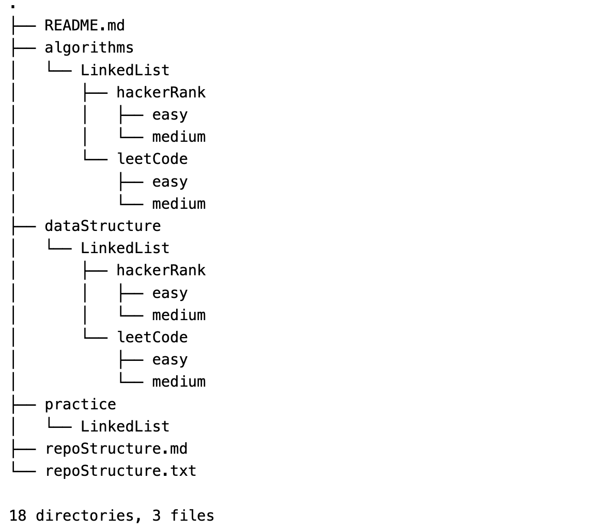

# Code Collections

 - [Data Structures](#data-structures) 
    - [LinkedList](#linkedlist) 
       - HackerRank
          - [Easy](#hackerrank-easy) 
          - [Medium](#hacker-rank-medium) 
       - LeetCode
          - [Easy](#leetcode-easy) 
          - [Medium](#leetcode-medium) 
- [File Structure](#file-structure)

# Data Structures

## LinkedList

## HackerRank Easy

| Problem                                                      | Solution                                                     |
| ------------------------------------------------------------ | ------------------------------------------------------------ |
| [Print the Elements of a Linked List ](https://www.hackerrank.com/challenges/print-the-elements-of-a-linked-list) | [**Link to Solution** ](https://github.com/arun-esh/codingPractice/blob/main/dataStructure/LinkedList/hackerRank/easy/PrintTheElementOfALinkedList.java) |
| [Insert a Node at the Tail of a Linked List ](https://www.hackerrank.com/challenges/print-the-elements-of-a-linked-list) | [**Link to Solution** ](https://github.com/arun-esh/codingPractice/blob/main/dataStructure/LinkedList/hackerRank/easy/InsertANodeAtTheTailOfALinkedList.java) |


## LeetCode Easy

| Index | Problem                                                      | Solution                                                     |
| ----- | ------------------------------------------------------------ | ------------------------------------------------------------ |
| 237   | [Delete Node in a Linked List](https://leetcode.com/problems/delete-node-in-a-linked-list/) | [**Link to Solution** ](https://github.com/arun-esh/codingPractice/blob/main/dataStructure/LinkedList/leetCode/easy/problem-easy-237.java) |


## File Structure



```
├── https://github.com/arun-esh/codingPractice/blob/main/README.md
├── https://github.com/arun-esh/codingPractice/blob/main/algorithms
│   └── https://github.com/arun-esh/codingPractice/blob/main/algorithms/LinkedList
│       ├── https://github.com/arun-esh/codingPractice/blob/main/algorithms/LinkedList/hackerRank
│       │   ├── https://github.com/arun-esh/codingPractice/blob/main/algorithms/LinkedList/hackerRank/easy
│       │   └── https://github.com/arun-esh/codingPractice/blob/main/algorithms/LinkedList/hackerRank/medium
│       └── https://github.com/arun-esh/codingPractice/blob/main/algorithms/LinkedList/leetCode
│           ├── https://github.com/arun-esh/codingPractice/blob/main/algorithms/LinkedList/leetCode/easy
│           └── https://github.com/arun-esh/codingPractice/blob/main/algorithms/LinkedList/leetCode/medium
├── https://github.com/arun-esh/codingPractice/blob/main/dataStructure
│   └── https://github.com/arun-esh/codingPractice/blob/main/dataStructure/LinkedList
│       ├── https://github.com/arun-esh/codingPractice/blob/main/dataStructure/LinkedList/hackerRank
│       │   ├── https://github.com/arun-esh/codingPractice/blob/main/dataStructure/LinkedList/hackerRank/easy
│       │   │   ├── https://github.com/arun-esh/codingPractice/blob/main/dataStructure/LinkedList/hackerRank/easy/InsertANodeAtTheTailOfALinkedList.java
│       │   │   └── https://github.com/arun-esh/codingPractice/blob/main/dataStructure/LinkedList/hackerRank/easy/PrintTheElementOfALinkedList.java
│       │   └── https://github.com/arun-esh/codingPractice/blob/main/dataStructure/LinkedList/hackerRank/medium
│       └── https://github.com/arun-esh/codingPractice/blob/main/dataStructure/LinkedList/leetCode
│           ├── https://github.com/arun-esh/codingPractice/blob/main/dataStructure/LinkedList/leetCode/easy
│           │   └── https://github.com/arun-esh/codingPractice/blob/main/dataStructure/LinkedList/leetCode/easy/problem-easy-237.java
│           └── https://github.com/arun-esh/codingPractice/blob/main/dataStructure/LinkedList/leetCode/medium
└── https://github.com/arun-esh/codingPractice/blob/main/practice
    └── https://github.com/arun-esh/codingPractice/blob/main/practice/LinkedList
        ├── https://github.com/arun-esh/codingPractice/blob/main/practice/LinkedList/Main.java
        └── https://github.com/arun-esh/codingPractice/blob/main/practice/LinkedList/myLinkedList.java

```
